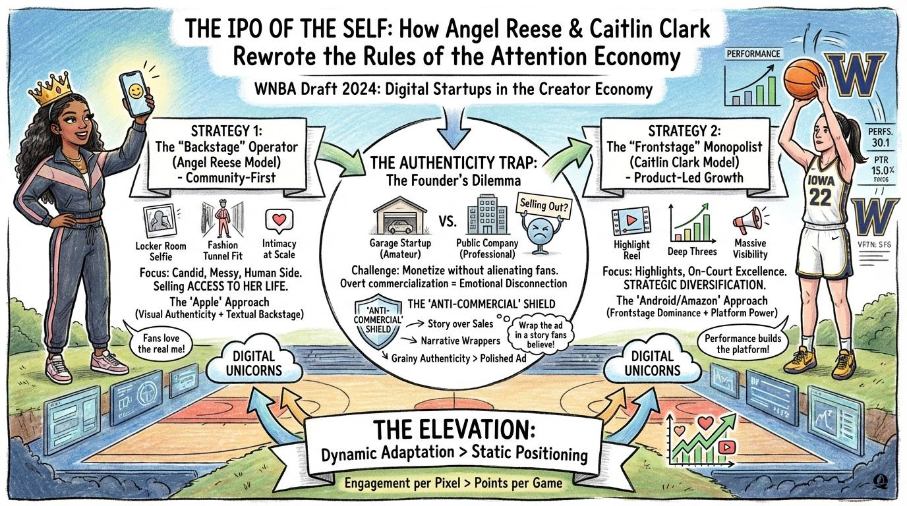
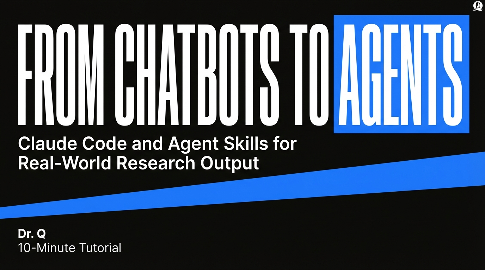
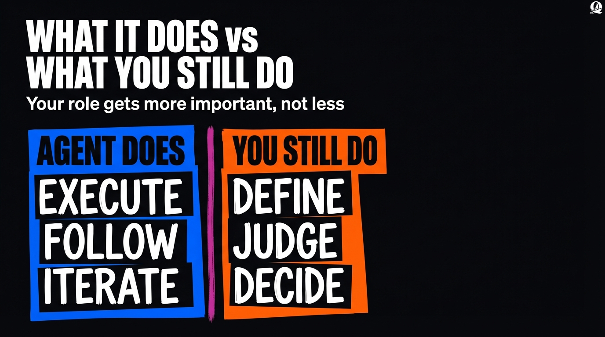

# q-skills

End-to-end skills for academic writing, data analysis, teaching, and research communication.

## Prerequisites

- [Claude Code](https://claude.ai/code) or compatible AI coding assistant
- Python 3.8+ (for script-based skills)
- pandas, openpyxl (for data processing skills)
- [Node.js](https://nodejs.org/) (for `npx`-based installation)

## Installation

Choose **one** of the methods below.

| Method | Best for |
| ------ | -------- |
| [Ask the Agent](#option-1-ask-the-agent-beginner-friendly) | **No coding experience needed** — just talk to Claude |
| [Quick Install](#option-2-quick-install) | Command-line users — installs all skills at once |
| [Plugin Marketplace](#option-3-plugin-marketplace) | Register once, then install all or specific skills |
| [Manual](#option-4-manual-clone-and-copy) | Offline or restricted environments |

---

### Option 1: Ask the Agent (Beginner-Friendly)

> **No coding experience required.** If you are new to Claude Code or not comfortable with the command line, this is the easiest way to get started. Just open Claude Code and type:

```
Please install skills from github.com/TyrealQ/q-skills
```

Claude will handle the installation for you — no terminal, no commands.

---

### Option 2: Quick Install

Requires [Node.js](https://nodejs.org/) for `npx`:

```bash
npx skills add TyrealQ/q-skills
```

---

### Option 3: Plugin Marketplace

Register q-skills as a plugin source in Claude Code, then install all or selected skills.

**Step 1 — Register** (run once inside Claude Code):

```
/plugin marketplace add TyrealQ/q-skills
```

**Step 2 — Install:**

To install all skills at once, use [Option 2](#option-2-quick-install) or browse via the Claude Code plugin UI after Step 1.

To install specific skills only:

```
/plugin install q-scholar@q-skills
/plugin install q-educator@q-skills
/plugin install q-infographics@q-skills
/plugin install q-presentations@q-skills
/plugin install q-topic-finetuning@q-skills
```

---

### Option 4: Manual (Clone and Copy)

```bash
git clone https://github.com/TyrealQ/q-skills.git
```

**Windows (PowerShell):**

```powershell
Copy-Item -Recurse -Force q-skills\skills\q-* $env:USERPROFILE\.claude\skills\
```

**macOS/Linux:**

```bash
cp -r q-skills/skills/q-* ~/.claude/skills/
```

> **Note:** The exact skills path depends on your AI assistant. Common locations: `~/.claude/skills/`, `~/.gemini/skills/`

## Update Skills

### Via Plugin UI (Recommended)

1. Run `/plugin` in Claude Code
2. Switch to the **Marketplaces** tab (arrow keys or Tab)
3. Select **q-skills**
4. Choose **Update marketplace**

You can also enable **auto-update** to receive the latest versions automatically.

### Force Reinstall

```bash
npx skills add TyrealQ/q-skills --force
```

### Manual Update

```bash
cd q-skills
git pull
```

Then re-copy the skills to your skills directory (see Manual install above).

---

## Available Skills

### Academic Writing Skills

| Skill                      | Description                                                   |
| -------------------------- | ------------------------------------------------------------- |
| [q-scholar](#q-scholar)    | Academic manuscript writing suite (methods, results, analysis) |

### Data Analysis Skills

| Skill                                     | Description                                                      |
| ----------------------------------------- | ---------------------------------------------------------------- |
| [q-topic-finetuning](#q-topic-finetuning) | Consolidate topic modeling outputs into theory-driven frameworks |

### Education Skills

| Skill                         | Description                                                                 |
| ----------------------------- | --------------------------------------------------------------------------- |
| [q-educator](#q-educator)     | Course content development for lectures, demos, assignments, and feedback   |

### Research Promotion Skills

| Skill                               | Description                                              |
| ----------------------------------- | -------------------------------------------------------- |
| [q-infographics](#q-infographics)   | Convert documents into business stories and infographics |
| [q-presentations](#q-presentations) | Convert content into branded slide decks with style presets |

---

## Skill Details

### q-scholar

Academic manuscript writing suite for drafting journal-ready prose following APA 7th edition standards. Orchestrates specialized sub-skills for complete manuscript preparation workflows.

**Sub-Skills:**

| Sub-Skill | Description |
| --------- | ----------- |
| q-intro | Introduction drafting and refinement with argumentative architecture guidance |
| q-descriptive-analysis | Comprehensive exploratory analysis of tabular datasets |
| q-methods | Methods section drafting in clear, narrative style |
| q-results | Results section drafting with APA-compliant tables |

**Triggers:**

- "Help me write the methods and results for my study"
- "Draft a results section for this analysis"
- "Analyze this dataset and generate descriptive statistics"

**Features:**

- End-to-end manuscript support (data exploration -> methods -> results)
- APA 7th edition formatting (tables, statistics, notation)
- Narrative prose style (no bullet points or em-dashes)
- Shared style guides and templates
- Appendix strategies for technical details

**Workflow Phases:**

1. **Data Exploration** - Invoke q-descriptive-analysis for statistics and summaries
2. **Introduction Drafting** - Invoke q-intro for context, gaps, RQs, and contributions
3. **Methods Documentation** - Invoke q-methods for data collection and analysis procedures
4. **Results Presentation** - Invoke q-results for findings organized by research questions

**Folder Structure:**

```text
q-scholar/
|-- SKILL.md                              # Orchestration skill
|-- references/                           # Shared style guides
|   |-- apa_style_guide.md                # Numbers, statistics, notation
|   `-- table_formatting.md               # APA 7th table examples
|-- q-intro/
|   |-- SKILL.md                          # Introduction drafting skill
|   `-- references/                       # Templates and interview questions
|-- q-descriptive-analysis/
|   `-- SKILL.md                          # Data exploration skill
|-- q-methods/
|   |-- SKILL.md                          # Methods drafting skill
|   `-- references/                       # Methods and appendix templates
`-- q-results/
    |-- SKILL.md                          # Results drafting skill
    `-- references/                       # Results template
```

**Example:**

```
Help me write the methods and results sections for my topic modeling study on esports discourse
```

---

### q-topic-finetuning

Fine-tune and consolidate topic modeling outputs (BERTopic, LDA, NMF) into theory-driven classification frameworks.

**Triggers:**

- "Consolidate these BERTopic topics..."
- "Classify topics using [framework]..."
- "Merge topic modeling results for my manuscript..."

**Features:**

- Convert 50+ raw topics into 20-50 manuscript-ready categories
- Apply theoretical frameworks (legitimacy, stakeholder theory, sentiment)
- Preserve domain-specific distinctions (entity, event, geography)
- Handle multi-category assignments with overlap reconciliation
- Generate Excel output with classification labels

**Folder Structure:**

```text
q-topic-finetuning/
|-- SKILL.md                                  # Main skill file
|-- scripts/
|   |-- classify_outliers.py                  # Outlier reclassification via Gemini
|   |-- generate_implementation_plan.py       # Full plan generation
|   `-- update_excel_with_labels.py           # Excel column updates
`-- references/
    |-- esports_ugc_example.md                # Worked example
    `-- SP_OUTLIER_TEMPLATE.txt               # Outlier classification prompt template
```

**Example:**

```
Consolidate my 129 BERTopic topics using organizational legitimacy framework
```

**Reference:** See `references/esports_ugc_example.md` for complete worked example.

---

### q-infographics

Convert documents into compelling business stories and cartoon-style infographics using Gemini 3.0 Pro.

**Triggers:**

- "Create an infographic from this document..."
- "Convert this paper to a visual summary..."
- "Generate a business story from..."

**Features:**

- Two-stage pipeline: Document -> Story -> Infographic
- Business story style (36Kr/Huxiu format) with "golden sentences"
- Hand-drawn cartoon-style infographics (16:9)
- Automatic logo branding on generated infographics
- Review checkpoints at each stage
- Supports PDF, DOCX, and text input (via markitdown)

**Requirements:**

- `pip install google-genai Pillow markitdown`
- `GEMINI_API_KEY` environment variable
- PowerShell (Windows): `$env:GEMINI_API_KEY = (Get-Content path\to\.env | Where-Object { $_ -match '^GEMINI_API_KEY=' } | Select-Object -First 1).Split('=',2)[1]`
- Bash (macOS/Linux): `export $(cat /path/to/.env | xargs)`

**Folder Structure:**

```text
skills/q-infographics/
|-- SKILL.md                              # Main skill file
|-- requirements.txt                      # Python dependencies
|-- assets/
|   `-- Logo_Q.png                        # Brand logo, auto-overlaid on infographics
|-- prompts/
|   |-- story.txt                         # Story generation prompt
|   `-- image.txt                         # Infographic generation prompt
|-- scripts/
|   |-- gen_story.py                      # Story generator script
|   `-- gen_image.py                      # Image generator script
`-- examples/                             # Sample outputs
```

**Example:**

```
Create an infographic from my research paper on gamification in esports
```

**Sample Outputs:**




---

### q-presentations

Convert content into branded slide decks with 16 visual style presets, layout-driven overlay safety, and automatic logo branding. Fork of [baoyu-slide-deck](https://github.com/JimLiu/baoyu-skills) with video-overlay-aware layout.

**Triggers:**

- "Create a slide deck from this content..."
- "Make a presentation about..."
- "Generate slides for my talk..."

**Features:**

- 16 style presets (blueprint, chalkboard, corporate, minimal, sketch-notes, watercolor, etc.)
- Composable dimension system (texture + mood + typography + density)
- Video-overlay-aware layout: internal layout-driven overlay-safe selection
- Automatic Dr. Q logo branding with configurable placement and auto-invert for dark styles
- Gemini 3.0 Pro image generation
- PPTX and PDF export
- Partial workflows (outline-only, prompts-only, regenerate specific slides)

**Requirements:**

- `pip install google-genai Pillow python-dotenv`
- `GEMINI_API_KEY` environment variable
- Bun available for PPTX/PDF merge scripts (`npx -y bun ...`)

**Folder Structure:**

```text
q-presentations/
|-- SKILL.md                              # Main skill file
|-- requirements.txt                      # Python dependencies
|-- assets/
|   `-- Logo_Q.png                        # Brand logo, auto-overlaid on slides
|-- references/
|   |-- base-prompt.md                    # Image generation base prompt
|   |-- design-guidelines.md              # Typography, colors, visual hierarchy
|   |-- layouts.md                        # 28 layout types
|   |-- outline-template.md               # Outline structure template
|   |-- config/preferences-schema.md      # EXTEND.md user preferences
|   |-- dimensions/                       # Composable style dimensions (5 files)
|   `-- styles/                           # 22 style definitions
`-- scripts/
    |-- gen_slide.py                      # Gemini API image generation
    |-- overlay_logo.py                   # Logo overlay with auto-invert
    |-- merge-to-pptx.ts                  # PPTX merge (Bun/TS)
    `-- merge-to-pdf.ts                   # PDF merge (Bun/TS)
`-- examples/                             # Sample outputs
```

**Example:**

```
Create a chalkboard-style slide deck from my research paper on AI agents
```

**Sample Outputs:**






---

### q-educator

Course content development skill for university teaching workflows. Produces interview-driven lecture outlines, demo plans, follow-up emails, assignment prompts, and per-group feedback.

**Triggers:**

- "Help me design next week's lecture..."
- "Draft an assignment prompt for this module..."
- "Write feedback for each student group..."

**Features:**

- Interview-first planning workflow before drafting
- Projects-first teaching philosophy with domain-specific analogies
- Structured deliverables for lecture, demo, email, assignment, and feedback
- Iterative review checkpoints after each deliverable
- Reference examples for assignments, lectures, emails, demos, and feedback

**Folder Structure:**

```text
q-educator/
|-- SKILL.md
`-- references/
    |-- assignment_example.md
    |-- demo_example.md
    |-- email_example.md
    |-- feedback_example.md
    `-- lecture_example.md
```

**Example:**

```
Help me build a week 6 lecture + demo + assignment plan for a graduate analytics course
```

---
## Acknowledgments

- Inspired by [baoyu-skills](https://github.com/JimLiu/baoyu-skills) by Jim Liu
- Built for use with Claude Code and compatible AI assistants

## License

MIT License - see [LICENSE](LICENSE) for details.

## Contributing

Contributions welcome! Please submit issues or pull requests.

